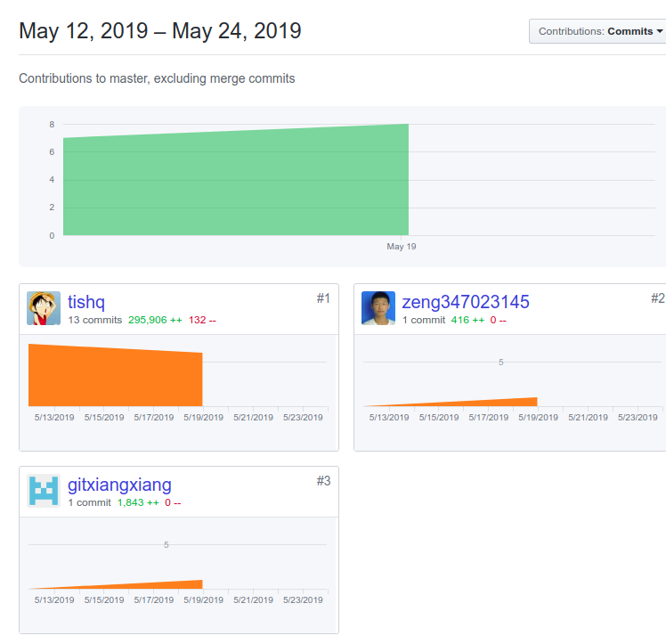

# 题目1：团队健康状态如何？

### 1 团队人员角色分配及职责履行情况说明；

| 团队人员 | 职责                                           | 贡献度 | 角色 |
| -------- | ---------------------------------------------- | ------ | ---- |
| 孟红全   | 数据爬取清洗,并为前段提供restfull风格的搜索api | 25%    | 组员 |
| 王秀霞   | android界面开发和主要文档撰写                  | 25%    | 组长 |
| 孙相鹏   | 整合前后端,并用微服务springCloud管理服务       | 25%    | 组员 |
| 曾强胜   | python实现文章推荐算法                         | 25%    | 组员 |

### 2 团队活动的组织与决策产生的过程说明；

### 3 项目、团队现存的主要风险及应对措施说明；

### 4 团队文化的建设与贡献情况说明；

团队文化是指团队成员在相互合作的过程中，为实现各自的人生价值，并为完成团队共同目标而形成的一种潜意识文化。

### 1 团队文化

- #### 团队内充满活力

  一起敲代码,一起玩耍

- #### 充分的尊重信任

  组员互相信任对方,对于组长安排的任务都能按时按量完成

- #### 技能互补

  根据大家兴趣,各自负责数据爬去,推荐算法,前段页面,微服务管理,用restfull风格api实现前后端数据交互.

  

### 2 贡献情况

**说明:为了简化操作,小组建了一个群,把各自的文档代码统一发到群里,最后主要由一个人负责在github上管理**

# 题目2：软件工程过程的实施如何？

### 1 在项目实践中应用了哪些RUP的最佳实践？

### 2 在项目实践中对敏捷过程产生的具有感悟？

### 3 在项目实践中采用了什么手段实现过程度量？

**用github实现过程度量**

### 通关度量发现了哪些问题,进行了哪些改进?
