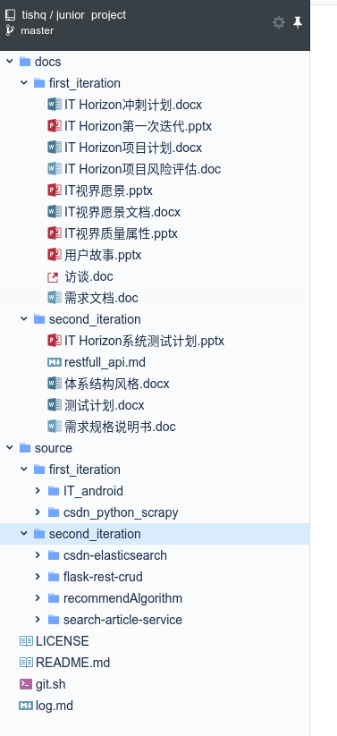
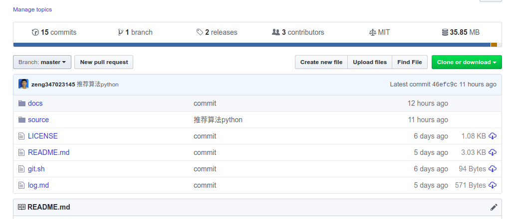
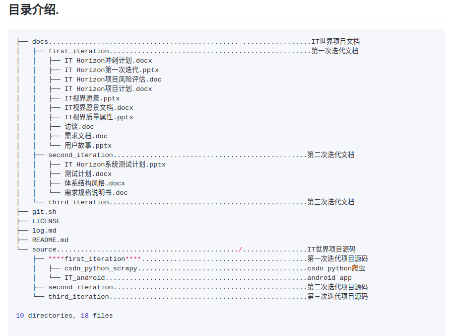
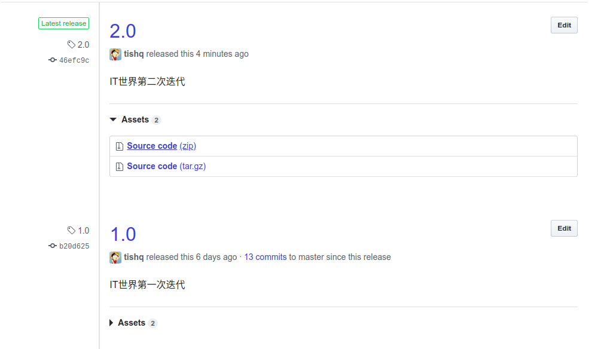

# 题目1：团队健康状态如何？

### 1 团队人员角色分配及职责履行情况说明；

| 团队人员 | 职责                                           | 贡献度 | 角色 |
| -------- | ---------------------------------------------- | ------ | ---- |
| 孟红全   | 数据爬取清洗,并为前段提供restfull风格的搜索api | 25%    | 组员 |
| 王秀霞   | android界面开发和主要文档撰写                  | 25%    | 组长 |
| 孙相鹏   | 整合前后端,并用微服务springCloud管理服务       | 25%    | 组员 |
| 曾强胜   | python实现文章推荐算法                         | 25%    | 组员 |

### 2 团队活动的组织与决策产生的过程说明；

- #### 团队活动的组织

###### 在迭代开始确定本次迭代每个人的工作任务，各自依据制定的接口，数据字典等独立开发，不定时汇报个人的开发成果。

- #### 团队决策

团队中每人负责不同的组件。王秀霞负责Android端的开发，曾强胜负责推荐算法的研究，孟红全负责爬虫以及部分框架的使用，孙相鹏负责服务端基础功能的搭建以及各个组件的整合。遇到需要决策的问题时，首先由两个人进行讨论，如果无法制定出方案，则四个人一起进行讨论，确定方案。对于存在较大分歧的问题，按照从用户角度出发和参照市面成熟软件的原则，产生较为合理的决策。

### 3 项目、团队现存的主要风险及应对措施说明；

#### 1) 风险1

- **描述**

数据库访问量太多，在高并发的情况下，系统无法响应。

- **策略**

采用静态化的HTML页面，及时将文章和社区里的帖子实时静态化。

采用数据库集群，将用户信息，文章等数据分开保存。

加入分布式缓存。

#### 2) 风险2

- **描述**

项目工作量很大，知识储备不足，完成项目的时间可能会推迟。

- **策略**

提前做好迭代计划，列好任务优先级以及每个任务的故事点。将任务划分的更加仔细。保证80%的任务不会出现延迟完结的情况。

#### 3) 风险3

- **描述**

虽然前人已经做过了类似推荐算法，但是不一定适用本项目，本项目的推荐算法由开发人员自行设计，可能会出现推荐准确度不高的情况.

- **策略**

大量阅读其他项目的推荐算法，注意归纳总结，借鉴别人经验.

### 4 团队文化的建设与贡献情况说明；

团队文化是指团队成员在相互合作的过程中，为实现各自的人生价值，并为完成团队共同目标而形成的一种潜意识文化。

### 1 )团队文化

- #### 团队内充满活力

  一起敲代码,一起玩耍

- #### 充分的尊重信任

  组员互相信任对方,对于组长安排的任务都能按时按量完成

- #### 技能互补

  根据大家兴趣,各自负责数据爬去,推荐算法,前段页面,微服务管理,用restfull风格api实现前后端数据交互.

### 2 )贡献情况

**说明:为了简化操作,小组建了一个群,把各自的文档代码统一发到群里,最后主要由一个人负责在github上管理**

# 题目2：软件工程过程的实施如何？

### 1 在项目实践中应用了哪些RUP的最佳实践？

- **迭代开发**

  分为三次迭代

  

  

- **持续集成**

  用restfull风格api交互前后端数据,前后端分离,方便持续集成

### 2 在项目实践中对敏捷过程产生的具有感悟？

| 组员   | 感悟                                                         |
| ------ | :----------------------------------------------------------- |
| 曾强胜 | 敏捷方法对每一次迭代周期的质量都有严格要求。敏捷开发团队拥有高水平的开发方法，有的会在正式开发功能代码之前先开发该功能的测试代码，质量可保证 |
| 孟红全 | 敏捷方法给了我很多启发,经常沟通交流可以更高效的解决问题.结对编程也可以提高效率,结对编程可以让编程变得更轻松,但是却很高效. |
| 孙相鹏 | 敏捷开发将一个大的项目划分为多个相对独立的小项目，提高了容错性，使得软件可维护，可修改。更重要的是，敏捷开发使用户的需求更容易得到实现，拥抱变更的概念使每次需求变更都能及时地反映到软件中。与此同时，敏捷开发也在一定程度上提高了项目管理的难度，对开发人员方法和技术上的要求也更高。如今的微服务架构与敏捷开发可谓是相辅相成。 |
| 王秀霞 | 敏捷开发使项目快速进入实质开发迭代阶段，用户很快可以看到一个基线架构版的产品，应对需求变化的能力强，即使到了开发后期，也可以相应需求变化，团队成员每隔一段时间进行反省，调整自己的行为，可以更高效的开发项目。 |

### 3 在项目实践中采用了什么手段实现过程度量？

**用github实现过程度量**

### 4 通关度量发现了哪些问题,进行了哪些改进?

#### 1)  第一个改进

- **问题**

 文档太多,目录结构混乱

- **改进**

废除第一次的目录结构,重新规范目录,并增加目录树说明

#### 2)  第二个改进

- **问题**

对代码进行了很大改动,但是发现不想这么改了,想回退一个版本

- **改进**

每次迭代完成,打包发布一个版本

#### 3)  第三个改进

- **问题**

组员一开始不太熟悉github,有时虽然写好了文档,但是没有提交.有时还会提交冲突

- **改进**

派一个人先熟悉github,整理知识,然后给大家分享技巧

[git 分支协同开发](https://github.com/tishq/junior_project/blob/master/docs/first_iteration/git%20%E5%88%86%E6%94%AF%E5%8D%8F%E5%90%8C%E5%BC%80%E5%8F%91.md)

